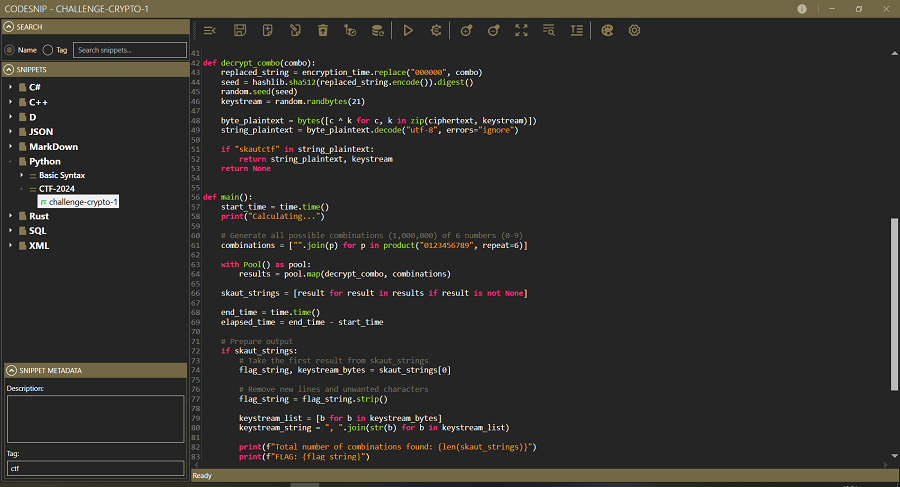

# CodeSnip

**CodeSnip** is a **personal snippet manager** built with **.NET 8 / C# / WPF** using a MVVM architecture.  



---

## Features

- **Local storage using SQLite database** — all snippets are stored privately on your device.
- **Snippet organization**:
  - Hierarchy: *Language → Category → Snippet* (TreeView)
  - Filter by name or tags
  - Instant search
- **AvalonEdit integration**:
  - Syntax highlighting (light/dark mode)
  - Code folding
  - Live editing of `.xshd` syntax definition files inside the app (Only colors and font styles)
- **Compiler Explorer (Godbolt) integration**:
  - Compile snippets without installing compilers locally
  - Support for 30+ languages
  - Add and edit available compilers
  - Select compiler and flags
  - View stdout/stderr output
  - Generate shareable shortlinks to [Compiler Explorer](https://godbolt.org/)
- **UI/UX**:
  - Modern Metro interface
  - Flyout panels for additional windows (settings, editors, actions, etc.)
  - Automatic loading of theme and syntax definitions
- **Export options**:
  - HTML
  - Original language format

---

## Libraries

- [AvalonEdit](https://github.com/icsharpcode/AvalonEdit)
- [CommunityToolkit.Mvvm](https://github.com/CommunityToolkit/dotnet)
- [Dapper](https://github.com/DapperLib/Dapper)
- [MahApps.Metro](https://github.com/MahApps/MahApps.Metro)
- [System.Data.SQLite.Core](https://system.data.sqlite.org/)

---

## Code Formatters

CodeSnip uses the following code formatters:

- [black](https://black.readthedocs.io/en/stable/) – Python code formatting
> **Note:** To use Python code formatting with **black**, you must have both **Python** and **black** installed on your computer.
- [clang-format](https://clang.llvm.org/docs/ClangFormat.html) – C, C++, C#, Java ... formatting
- [CSharpier](https://csharpier.com/) – C# code formatting
- [dfmt](https://github.com/dlang-community/dfmt) – D code formatting
- [rustfmt](https://github.com/rust-lang/rustfmt) – Rust code formatting

---

## Building

The project source code is located in the `src` directory. To build and run CodeSnip, you'll need the **.NET 8 SDK** or later.

### For Development

1.  Clone the repository:
    ```bash
    git clone https://github.com/mx7b7/codesnip-wpf.git
    ```
2.  Navigate to the project's root directory:
    ```bash
    cd codesnip-wpf
    ```
3.  Build the project from the root directory:

    - For **Debug** build:
      ```bash
      dotnet build src/CodeSnip -c Debug
      ```

    - For **Release** build:
      ```bash
      dotnet build src/CodeSnip -c Release
      ```
4.  Run the application from your IDE (like Visual Studio or VS Code) or using the CLI:
    ```bash
    dotnet run --project src/CodeSnip
    ```
    On first launch, the application will automatically create the database in the executable's directory, load languages, and import initial categories/snippets.

### Creating a Self-Contained Release Package

A convenient batch script is included in the root directory to create a portable, self-contained, single-file executable for Windows (x64).

1.  Make sure you are in the root directory of the project.
2.  Run the `build.bat` script:
    ```cmd
    .\build.bat
    ```
3.  The script will build the project from the `src` folder and create a `release` folder in the root directory, containing the `CodeSnip.exe` file and all necessary components. You can copy this `release` folder anywhere.

---


## License

This project is licensed under the MIT License - see the [LICENSE](LICENSE) file for details.

